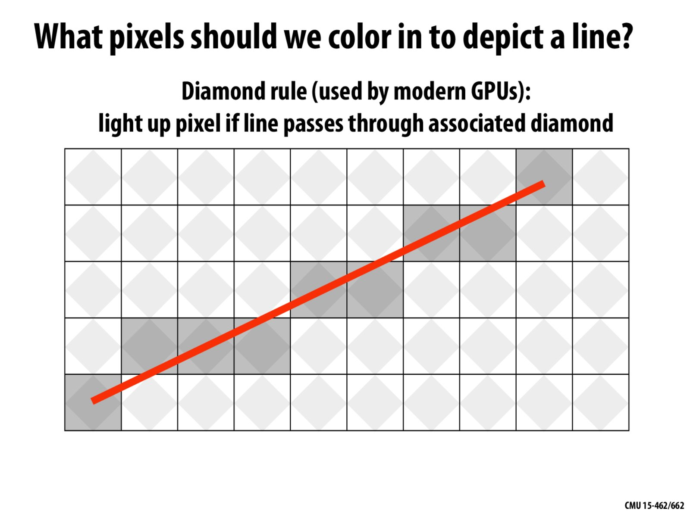

# Overview Computer Graphics
- Main Objectives:
  - Try to understand broadly what computer graphics is about
  - "Implement" our 1st algorithm for making images of 3D shapes
## What is Computer Graphics
The use of computers to synthesize visual infomation.
## Fundations of computer graphics
- Thoory
  - basic representations (how do you digitally encode shape, motion?)
  - sampling & aliasing (how do you acquire & reproduce a signal?)
  - numerical methods (how do you manipulate signals numerically?)
  - radiometry & light transport (how does light behave?)
  - precepetion (how does this all relate to humans?)
  - ...
- Systems 
  - parallel, heterogeneous processing
  - graphics-specific programming languages
  - ...
## Activity: drawing the cube
- How to describe the cube?
- How do we draw this 3D cube as a 2D(flat) image?
  - perspective projection
- Rasterization: process of converting a continuous object to a discrete representation on a raster grid (pixel grid)
